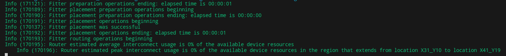

# Project description

Microprocessor design written in verilog hdl, with addition of verification of some modules written in System Verilog.

The architecture of microprocessor is **PicoComputer** arch.

**PicoComputer** microprocessor architecture is developed by **Department of Computer Science of School of Electrical engineering** in Belgrade. The architecutre is developed to be simple, with small number of instructions because it is used to demonstrate to new students basics of how microprocessor works and basic assembler code.

The project is practical part of subject called **VLSI Systems**. The main point of subject is not to teach us to write optimal HDL code, but to tech us basics of design, verification and simulation of hardware. With that in mind, this project is not written to be optimal and may not use the best HDL practices but is great starting project for learning VLSI.

# Project phases

Project consisted of three phases:
- **Simulation** (Testing in ModelSim)
    - Create register and alu modules and create testbench for them in modelsim.
        - *creating register module writing HDL code may not be the best practice but is here used to demonstrate our knowledge of computer architecture class*

- **Synthesis** (Testing on FPGA chip)
    - Create full cpu, and top module with ps/2 and vga "peripherals" used as input and output of the cpu module.
            - *these are not classic peripherals, you cannot access them from code but are simply used to represent a form of input and output to the processor*

- **Verification** (Testing in QuestSim)
    - Create verification code for register module.

# List of modules

Located in `src/synthesis` directory:
<!-- main -->
- Register - register.v
- Arithmetical Logical Unit - alu.v
<!-- utils -->
- Clock divider - clk_div.v
- Debouncer - debouncer.v
- Rising edge detector - red.v
<!-- ps/2 -->
- PS/2 "controller" - ps2.v
- Scan code decoder - scan_codes.v
<!-- ssd -->
- Binary-coded Decimal - bcd.v
- Binary hex digit seven segment display - ssd.v
<!-- vga -->
- VGA "controller" - vga.v
- Color code decoder - color_codes.v
<!-- top -->
- Memory - memory.v
- Central proccessing unit - cpu.v
- Top level module - top.v

More about them you can find in docs `Postavka.pdf`(serbian).
*TODO: add English explanation*

# CPU capabilities

*TODO*

# Prerequisites

*TODO*

# Makefile use

**Variable override**:

- **PLATFORM_WINDOWS**: 
    - **1** - running makefile from windows (default)
    - **else** - running makefile from linux

- **SIMUL_SYNTH**
    - **1** - run simulation with modules from `src/synthesis` with `testbench.v` as top level
    - **else** - just use modules from `src/simulate` (default)

- **PHASE_3**
    - **1** - add ps2 and vga support in `src/synthesis` modules
    - **else** - no vga and ps2 support (default)

- **HW_C3**
    - **1** - use top level synthesis for Cyclone3 board (default)
    - **else** - use top level synthesis for Cyclone5 board

- **MODIF**
    - **1** - simulate or synth with modifications added
        - simulation: testbench the memory module
        - synthesis: add support for two vector instructions (Move multiple, output multiple)
    - **else** - no modifications (defult)

- **TEST**
    - **1** - use outputs on the board (hex and leds) for outputing custom values
    - **else** - use outputs on the board for project specified outputs
- HEXTEST_1 
- HEXTEST_2

- **VERIF**
    - **1** - if in simulations is done verification of register module 
    - **else** - normal simulation is done
    

## **Simulation**

*TODO*

## **Synthesis**

*TODO*

## **Verification**

*TODO*

**Disclamer for linux users**: Full synthesis on linux wont work correctly.
- In some cases when fitting and routing begin it will never end. The fitter will just be stuck on this line:
    
- still haven't found the solution to the problem
